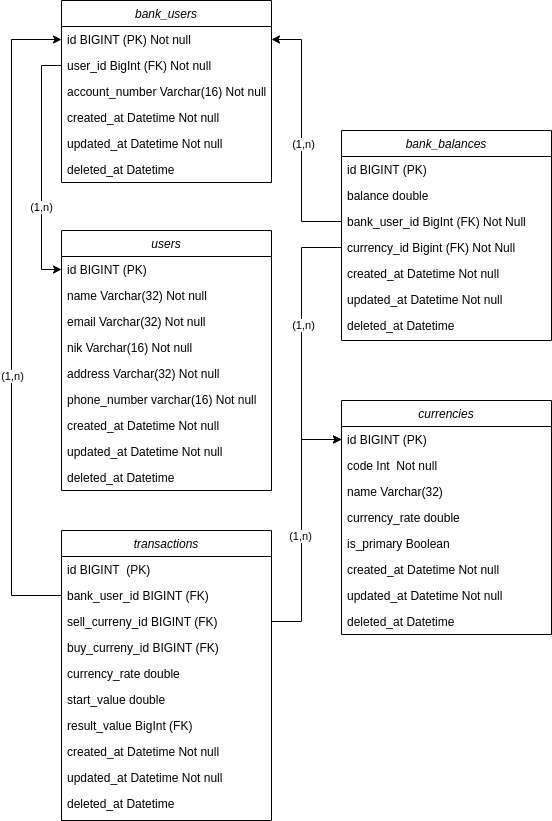
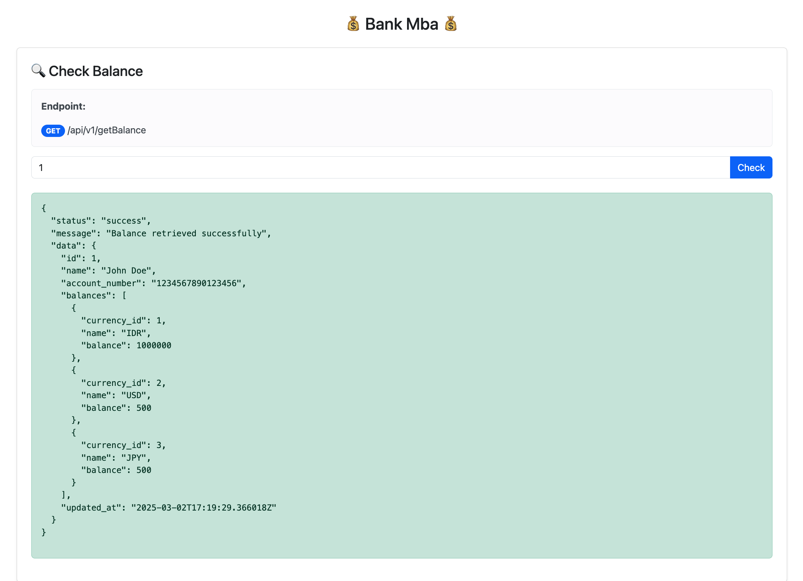
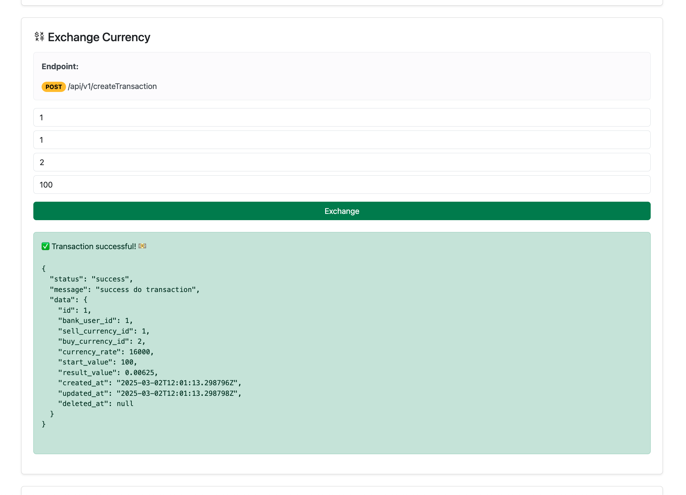
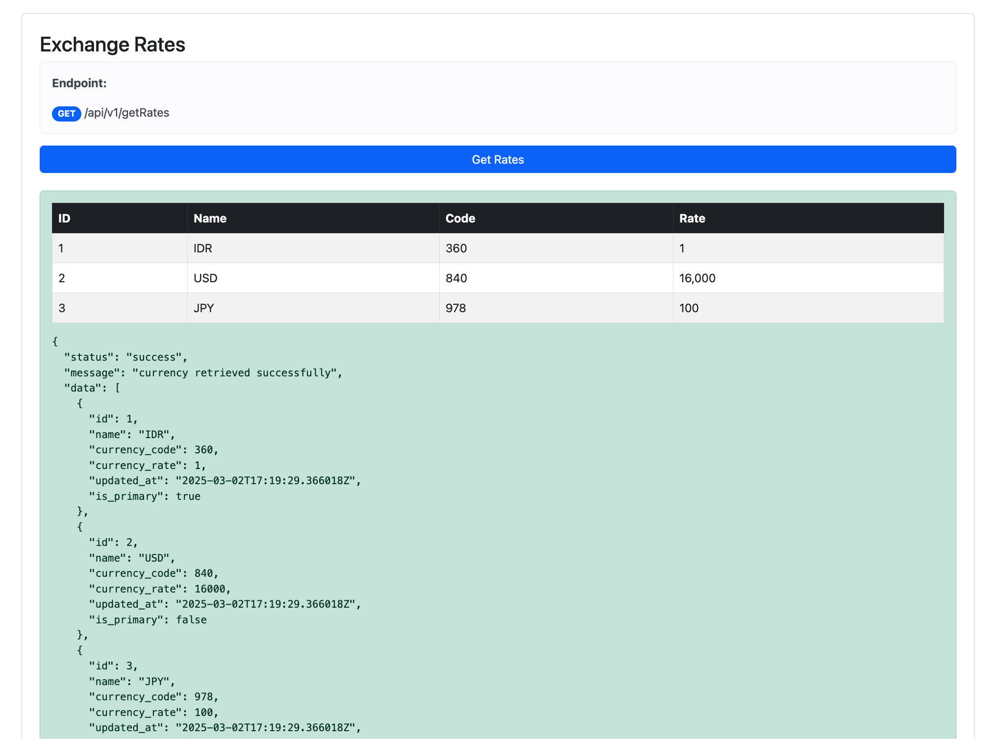

# Java Spring Boot Assignment: Bank MBA

## Members
- Alif Naufal Hidayat
- Muhammad Andika Naufan Dwiandharu
- Ridwan Ramadhan
- Brilian Febrianie

## How to run
1. Setup your postgres database
2. Execute ddl.sql and dml.sql file which in the location src/sql folder to your database
3. Change the paramater in application.properties file based on your environment
4. Run the application using the command `mvn spring-boot:run`
5. The browser will automatically open and display the frontend view for checking or You can test the application at your browser using the url `http://localhost:4000`. You can use this link https://documenter.getpostman.com/view/20730821/2sAYdhLWXS for the documentation endpoint api

## Database Disgn

## Frontend for Test

